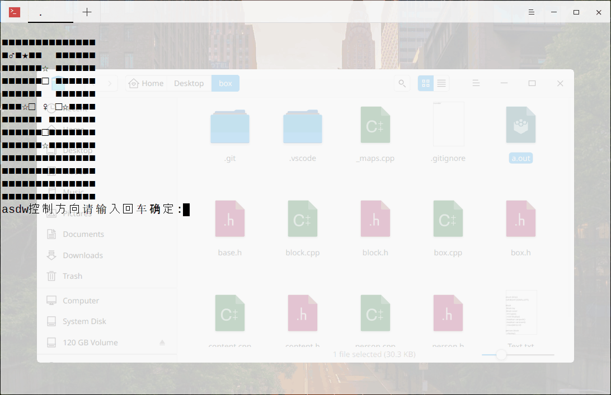

## c++推箱子
[图形界面版](https://github.com/liubailin2017/box/tree/graph)
## 编译
没编写makefile 请直接用命令编译

    g++ *.cpp

## 说明
可在 [_maps.h](https://github.com/liubailin2017/box/blob/master/_maps.h) 文件中编辑地图
## 演示
加载图片请稍候...

## 下载
[windows](https://github.com/liubailin2017/box/releases/download/1.011/box.exe)
[linux](https://github.com/liubailin2017/box/releases/download/1.011/box)
