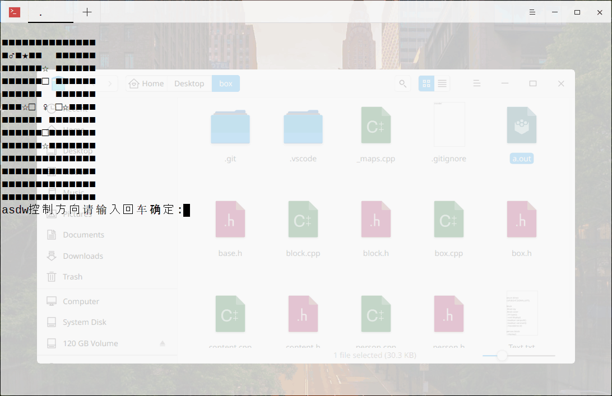

# c++推箱子
## note
大家别浪费时间看，这个项目是垃圾，作者自己也编译不了了 
## 操作说明

    <鼠标拖动搬运工> <点击空白处，或箱子> 控制方向
    <上、下、左、右 键> 控制方向
    <空格> <右键> 返回
    <pgup> 下一关
    <pgdn> 上一关

    另外通过的关卡，窗口标题栏会有<*>提示

## 特征

在[map.txt](https://github.com/liubailin2017/box/blob/graph/map.txt)文件中编辑地图

    自定义地图说明
    8: 目的地 ☆
    4: 墙壁  ■
    2: 箱子  □
    1: 玩家  ♀
    0: 空地
    10:箱子已在目的地  ★
    9:人在目的地上  ♂

## 演示

[B站](https://www.bilibili.com/video/BV1Sa4y1e7nv)
## 依赖 (推荐使用vcpkg)

### [SDL2](http://www.libsdl.org/download-2.0.php)

### SDL2_image 
### SDL2_ttf 

## 编译

## 下载

### [windows](https://github.com/liubailin2017/box/releases/download/1.10-g/output.zip)

### [linux](https://github.com/liubailin2017/box/releases/download/ver1.1-g/box-linux.tar)
